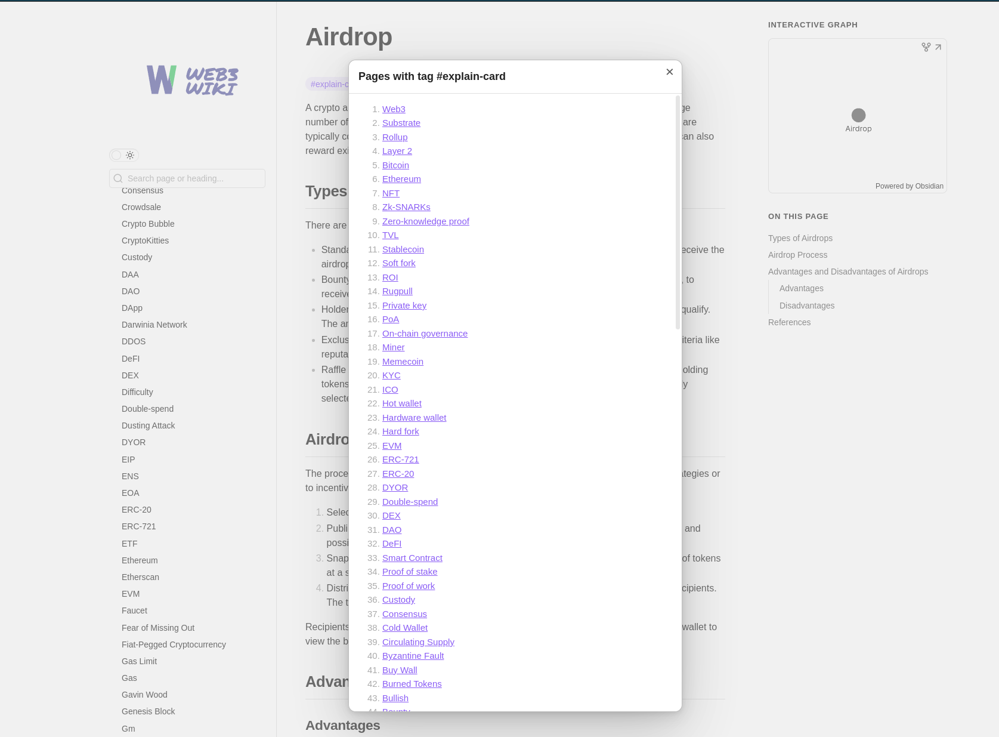

# Web3 Wiki

>[!note]
> This wiki leverages [Obsidian](https://obsidian.md/) to create a comprehensive knowledge graph for your benefit. 

Welcome to the Web3 Wiki, a collaborative space for the Web3 community to gather and share knowledge about Web3 technologies. 

The wiki is organized into thousands of cards, each representing an independent knowledge unit that links to other cards. There are three types of cards in this wiki:

* `explain-card`: Provides explanations of concepts, technologies, or protocols, such as [Hard fork](https://publish.obsidian.md/web3-wiki/cards/Hard+fork) or [Rollup](https://publish.obsidian.md/web3-wiki/cards/Rollup).
* `show-card`: Highlights projects, tools, or services, such as [Solana](https://publish.obsidian.md/web3-wiki/cards/Solana) or [Etherscan](https://publish.obsidian.md/web3-wiki/cards/Etherscan).
* `awesome-card`: Curates collections of excellent resources, such as [Awesome Ethereum](https://publish.obsidian.md/web3-wiki/cards/Awesome+Ethereum) or [Awesome Polkadot](https://publish.obsidian.md/web3-wiki/cards/Awesome+Polkadot).

You can click on a tag within a card to view all related cards with the same tag. We hope you find valuable insights each time you visit.

